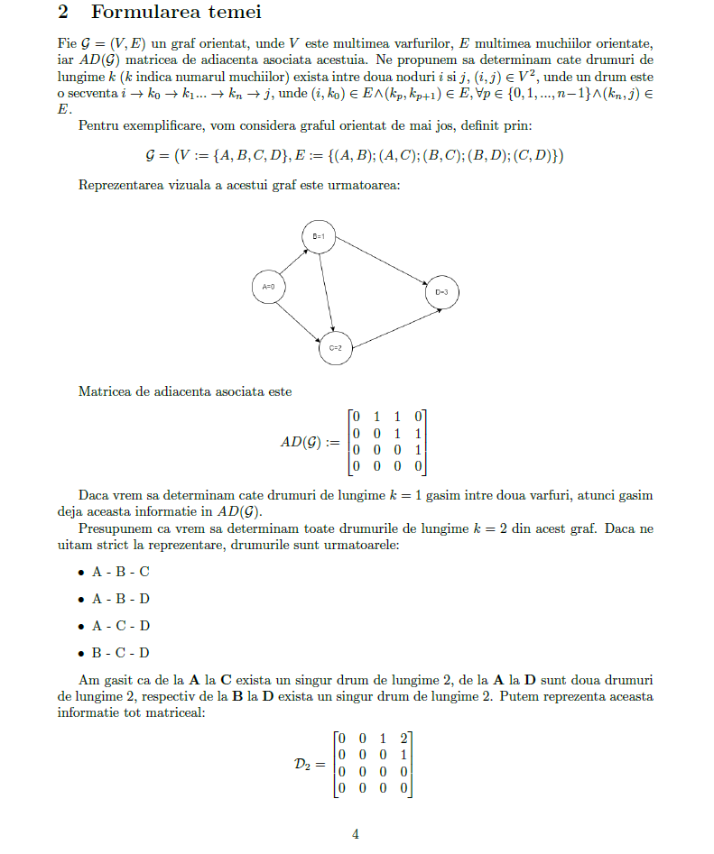
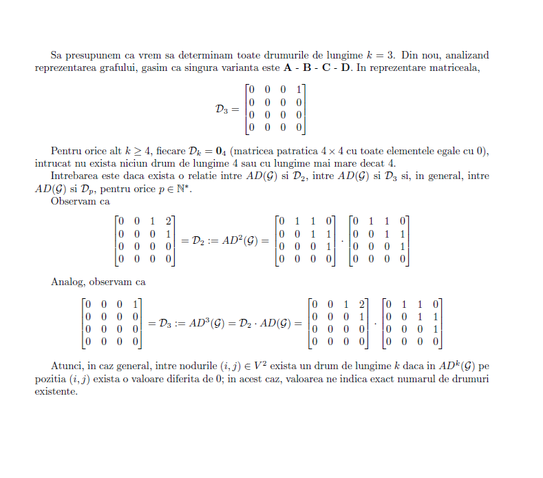

# Assembly project
 To find the shortest distances, multiplying matrixes using assembly code.
## Teorie

## Cerinte
[Cerinte proiect](https://github.com/ElenaNazare/Assembly-project/blob/main/Arhitectura%20Sistemelor%20de%20Calcul%20(ASC)%20-%20Tema%20Laborator%202022.pdf)
